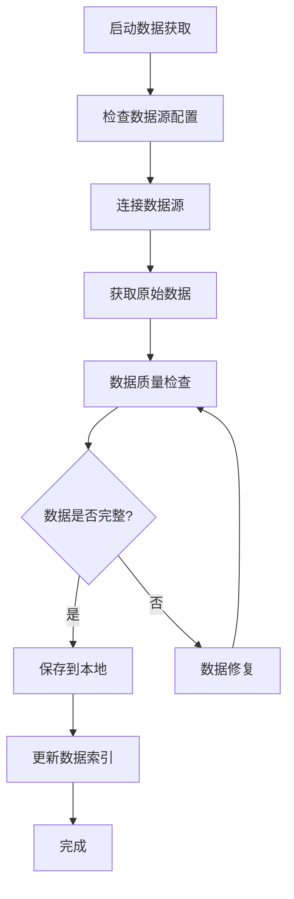
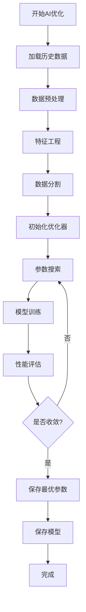

# 👨‍💻 开发者指南

本指南面向希望理解、修改或扩展中证500指数量化交易系统的开发者。

## 🏗️ 系统架构

### 整体架构图

```
┌─────────────────┐    ┌─────────────────┐    ┌─────────────────┐
│   数据层 (Data)  │    │  策略层 (Strategy) │    │   AI层 (AI)     │
├─────────────────┤    ├─────────────────┤    ├─────────────────┤
│ • 数据获取       │    │ • 技术指标计算   │    │ • 参数优化       │
│ • 数据清洗       │◄──►│ • 信号生成       │◄──►│ • 模型训练       │
│ • 数据存储       │    │ • 回测引擎       │    │ • 预测推理       │
└─────────────────┘    └─────────────────┘    └─────────────────┘
           ▲                       ▲                       ▲
           │                       │                       │
           ▼                       ▼                       ▼
┌─────────────────┐    ┌─────────────────┐    ┌─────────────────┐
│  工具层 (Utils)  │    │  配置层 (Config) │    │  接口层 (CLI)    │
├─────────────────┤    ├─────────────────┤    ├─────────────────┤
│ • 日志管理       │    │ • 参数管理       │    │ • 命令解析       │
│ • 文件操作       │    │ • 配置验证       │    │ • 结果输出       │
│ • 通用函数       │    │ • 环境变量       │    │ • 错误处理       │
└─────────────────┘    └─────────────────┘    └─────────────────┘
```

### 模块依赖关系

```
run.py (入口)
├── src/
│   ├── data/
│   │   ├── data_fetcher.py      # 数据获取
│   │   ├── data_processor.py    # 数据处理
│   │   └── data_validator.py    # 数据验证
│   ├── strategy/
│   │   ├── indicators.py        # 技术指标
│   │   ├── signal_generator.py  # 信号生成
│   │   └── backtest_engine.py   # 回测引擎
│   ├── ai/
│   │   ├── ai_optimizer_improved.py  # AI优化器
│   │   ├── model_trainer.py     # 模型训练
│   │   └── predictor.py         # 预测器
│   └── utils/
│       ├── config_loader.py     # 配置加载
│       ├── logger.py            # 日志管理
│       └── file_utils.py        # 文件工具
└── config/
    ├── system.yaml              # 系统配置
    ├── strategy.yaml            # 策略配置
    └── optimized_params.yaml    # 优化参数
```

## 📁 目录结构详解

### 源代码目录 (src/)

```
src/
├── data/                    # 数据处理模块
│   ├── __init__.py
│   ├── data_fetcher.py      # 数据获取接口
│   ├── data_processor.py    # 数据预处理
│   ├── data_validator.py    # 数据质量检查
│   └── market_data.py       # 市场数据封装
├── strategy/                # 策略模块
│   ├── __init__.py
│   ├── indicators.py        # 技术指标计算
│   ├── signal_generator.py  # 交易信号生成
│   ├── backtest_engine.py   # 回测引擎
│   ├── risk_manager.py      # 风险管理
│   └── portfolio.py         # 投资组合管理
├── ai/                      # AI模块
│   ├── __init__.py
│   ├── ai_optimizer_improved.py  # 主优化器
│   ├── genetic_algorithm.py # 遗传算法
│   ├── bayesian_optimizer.py # 贝叶斯优化
│   ├── model_trainer.py     # 模型训练器
│   ├── predictor.py         # 预测器
│   └── feature_engineer.py  # 特征工程
├── utils/                   # 工具模块
│   ├── __init__.py
│   ├── config_loader.py     # 配置文件加载
│   ├── logger.py            # 日志系统
│   ├── file_utils.py        # 文件操作
│   ├── date_utils.py        # 日期工具
│   ├── math_utils.py        # 数学工具
│   └── visualization.py     # 可视化工具
└── notification/            # 通知模块
    ├── __init__.py
    ├── email_notifier.py    # 邮件通知
    └── console_notifier.py  # 控制台通知
```

### 配置目录 (config/)

```
config/
├── system.yaml              # 系统基础配置
├── strategy.yaml            # 策略参数配置
├── optimized_params.yaml    # AI优化后的参数
└── logging.yaml             # 日志配置（可选）
```

### 数据目录 (data/)

```
data/
├── raw/                     # 原始数据
│   ├── SHSE.000905_1d.csv   # 中证500日线数据
│   └── market_calendar.csv  # 交易日历
├── processed/               # 处理后数据
│   ├── features.csv         # 特征数据
│   └── labels.csv           # 标签数据
└── cache/                   # 缓存数据
    └── indicators_cache.pkl  # 指标缓存
```

## 🔧 核心模块详解

### 1. 数据模块 (src/data/)

#### data_fetcher.py

```python
class DataFetcher:
    """数据获取器"""
    
    def __init__(self, config: dict):
        self.config = config
        self.data_source = config.get('data_source', 'akshare')
    
    def fetch_index_data(self, symbol: str, start_date: str, end_date: str = None) -> pd.DataFrame:
        """获取指数数据"""
        pass
    
    def fetch_market_calendar(self) -> pd.DataFrame:
        """获取交易日历"""
        pass
```

#### data_processor.py

```python
class DataProcessor:
    """数据处理器"""
    
    def clean_data(self, df: pd.DataFrame) -> pd.DataFrame:
        """数据清洗"""
        pass
    
    def calculate_returns(self, df: pd.DataFrame) -> pd.DataFrame:
        """计算收益率"""
        pass
    
    def handle_missing_data(self, df: pd.DataFrame) -> pd.DataFrame:
        """处理缺失数据"""
        pass
```

### 2. 策略模块 (src/strategy/)

#### indicators.py

```python
class TechnicalIndicators:
    """技术指标计算器"""
    
    @staticmethod
    def rsi(prices: pd.Series, period: int = 14) -> pd.Series:
        """计算RSI指标"""
        pass
    
    @staticmethod
    def bollinger_bands(prices: pd.Series, period: int = 20, std_dev: float = 2) -> tuple:
        """计算布林带"""
        pass
    
    @staticmethod
    def macd(prices: pd.Series, fast: int = 12, slow: int = 26, signal: int = 9) -> tuple:
        """计算MACD"""
        pass
```

#### signal_generator.py

```python
class SignalGenerator:
    """信号生成器"""
    
    def __init__(self, config: dict):
        self.config = config
        self.indicators = TechnicalIndicators()
    
    def generate_signals(self, data: pd.DataFrame) -> pd.DataFrame:
        """生成交易信号"""
        pass
    
    def calculate_confidence(self, data: pd.DataFrame, index: int) -> float:
        """计算置信度"""
        pass
```

### 3. AI模块 (src/ai/)

#### ai_optimizer_improved.py

```python
class AIOptimizer:
    """AI参数优化器"""
    
    def __init__(self, config: dict):
        self.config = config
        self.genetic_optimizer = GeneticAlgorithm(config)
        self.bayesian_optimizer = BayesianOptimizer(config)
    
    def optimize_parameters(self, data: pd.DataFrame) -> dict:
        """优化参数"""
        pass
    
    def train_model(self, data: pd.DataFrame, params: dict) -> object:
        """训练模型"""
        pass
```

## 🔄 数据流程

### 1. 数据获取流程



### 2. AI优化流程



## 🧪 测试框架

### 单元测试结构

```
tests/
├── __init__.py
├── test_data/
│   ├── test_data_fetcher.py
│   ├── test_data_processor.py
│   └── test_data_validator.py
├── test_strategy/
│   ├── test_indicators.py
│   ├── test_signal_generator.py
│   └── test_backtest_engine.py
├── test_ai/
│   ├── test_ai_optimizer.py
│   ├── test_genetic_algorithm.py
│   └── test_bayesian_optimizer.py
├── test_utils/
│   ├── test_config_loader.py
│   └── test_file_utils.py
└── fixtures/
    ├── sample_data.csv
    └── test_config.yaml
```

### 测试示例

```python
# tests/test_strategy/test_indicators.py
import unittest
import pandas as pd
from src.strategy.indicators import TechnicalIndicators

class TestTechnicalIndicators(unittest.TestCase):
    
    def setUp(self):
        # 创建测试数据
        self.test_data = pd.Series([100, 102, 101, 103, 105, 104, 106])
    
    def test_rsi_calculation(self):
        """测试RSI计算"""
        rsi = TechnicalIndicators.rsi(self.test_data, period=6)
        self.assertIsInstance(rsi, pd.Series)
        self.assertTrue(0 <= rsi.iloc[-1] <= 100)
    
    def test_bollinger_bands(self):
        """测试布林带计算"""
        upper, middle, lower = TechnicalIndicators.bollinger_bands(self.test_data)
        self.assertTrue(upper.iloc[-1] > middle.iloc[-1] > lower.iloc[-1])
```

### 运行测试

```bash
# 运行所有测试
python -m pytest tests/

# 运行特定模块测试
python -m pytest tests/test_strategy/

# 运行单个测试文件
python -m pytest tests/test_strategy/test_indicators.py

# 生成覆盖率报告
python -m pytest --cov=src tests/
```

## 🔧 开发环境设置

### 1. 开发依赖

```bash
# 安装开发依赖
pip install -r requirements-dev.txt
```

**requirements-dev.txt**:
```
# 基础依赖
-r requirements.txt

# 开发工具
pytest>=7.0.0
pytest-cov>=4.0.0
black>=22.0.0
flake8>=5.0.0
mypy>=0.991
pre-commit>=2.20.0

# 文档工具
sphinx>=5.0.0
sphinx-rtd-theme>=1.0.0
```

### 2. 代码格式化

```bash
# 使用black格式化代码
black src/ tests/

# 使用flake8检查代码风格
flake8 src/ tests/

# 使用mypy进行类型检查
mypy src/
```

### 3. Git钩子设置

```bash
# 安装pre-commit钩子
pre-commit install
```

**.pre-commit-config.yaml**:
```yaml
repos:
  - repo: https://github.com/psf/black
    rev: 22.10.0
    hooks:
      - id: black
        language_version: python3
  
  - repo: https://github.com/pycqa/flake8
    rev: 5.0.4
    hooks:
      - id: flake8
  
  - repo: https://github.com/pre-commit/mirrors-mypy
    rev: v0.991
    hooks:
      - id: mypy
```

## 📝 编码规范

### 1. Python代码风格

- 遵循 PEP 8 标准
- 使用 Black 进行代码格式化
- 行长度限制为 88 字符
- 使用类型提示

### 2. 命名规范

```python
# 类名：大驼峰
class DataProcessor:
    pass

# 函数名：小写+下划线
def calculate_rsi(prices: pd.Series) -> pd.Series:
    pass

# 常量：大写+下划线
DEFAULT_RSI_PERIOD = 14

# 私有方法：前缀下划线
def _internal_method(self):
    pass
```

### 3. 文档字符串

```python
def calculate_rsi(prices: pd.Series, period: int = 14) -> pd.Series:
    """
    计算相对强弱指数(RSI)
    
    Args:
        prices: 价格序列
        period: 计算周期，默认14
    
    Returns:
        RSI值序列
    
    Raises:
        ValueError: 当period小于1时
    
    Example:
        >>> prices = pd.Series([100, 102, 101, 103])
        >>> rsi = calculate_rsi(prices)
        >>> print(rsi)
    """
    pass
```

## 🚀 性能优化

### 1. 数据处理优化

```python
# 使用向量化操作
# 好的做法
df['returns'] = df['close'].pct_change()

# 避免循环
# 不好的做法
for i in range(1, len(df)):
    df.loc[i, 'returns'] = (df.loc[i, 'close'] - df.loc[i-1, 'close']) / df.loc[i-1, 'close']
```

### 2. 内存优化

```python
# 使用适当的数据类型
df['volume'] = df['volume'].astype('int32')  # 而不是int64
df['price'] = df['price'].astype('float32')  # 而不是float64

# 及时释放内存
del large_dataframe
gc.collect()
```

### 3. 缓存机制

```python
from functools import lru_cache

@lru_cache(maxsize=128)
def expensive_calculation(param1: str, param2: int) -> float:
    """昂贵的计算，使用缓存"""
    pass
```

## 🔍 调试技巧

### 1. 日志调试

```python
import logging

logger = logging.getLogger(__name__)

def debug_function():
    logger.debug("开始执行函数")
    logger.info(f"处理数据: {data.shape}")
    logger.warning("发现异常值")
    logger.error("计算失败")
```

### 2. 断点调试

```python
# 使用pdb进行调试
import pdb

def problematic_function():
    pdb.set_trace()  # 设置断点
    # 代码逻辑
    pass
```

### 3. 性能分析

```python
# 使用cProfile进行性能分析
python -m cProfile -o profile_output.prof run.py ai

# 分析结果
python -c "import pstats; pstats.Stats('profile_output.prof').sort_stats('cumulative').print_stats(10)"
```

## 📦 部署指南

### 1. 生产环境配置

```yaml
# config/production.yaml
system:
  log_level: "WARNING"
  enable_debug: false
  max_memory_usage: "4GB"
  
data:
  cache_enabled: true
  batch_size: 1000
```

### 2. Docker部署

```dockerfile
# Dockerfile
FROM python:3.9-slim

WORKDIR /app

COPY requirements.txt .
RUN pip install -r requirements.txt

COPY . .

CMD ["python", "run.py", "ai"]
```

### 3. 监控和日志

```python
# 添加监控指标
import time
import psutil

def monitor_performance(func):
    def wrapper(*args, **kwargs):
        start_time = time.time()
        start_memory = psutil.Process().memory_info().rss
        
        result = func(*args, **kwargs)
        
        end_time = time.time()
        end_memory = psutil.Process().memory_info().rss
        
        logger.info(f"函数 {func.__name__} 执行时间: {end_time - start_time:.2f}秒")
        logger.info(f"内存使用变化: {(end_memory - start_memory) / 1024 / 1024:.2f}MB")
        
        return result
    return wrapper
```

## 🤝 贡献指南

### 1. 开发流程

1. Fork 项目
2. 创建特性分支: `git checkout -b feature/new-feature`
3. 提交更改: `git commit -am 'Add new feature'`
4. 推送分支: `git push origin feature/new-feature`
5. 创建 Pull Request

### 2. 代码审查清单

- [ ] 代码符合PEP 8规范
- [ ] 添加了适当的测试
- [ ] 更新了相关文档
- [ ] 通过了所有测试
- [ ] 没有引入新的依赖（或已说明原因）
- [ ] 性能没有显著下降

### 3. 提交信息规范

```
type(scope): description

[optional body]

[optional footer]
```

**类型**:
- `feat`: 新功能
- `fix`: 修复bug
- `docs`: 文档更新
- `style`: 代码格式
- `refactor`: 重构
- `test`: 测试
- `chore`: 构建过程或辅助工具的变动

**示例**:
```
feat(ai): add bayesian optimization algorithm

Implement bayesian optimization for parameter tuning
to improve convergence speed and accuracy.

Closes #123
```

---

**联系方式**：如有开发相关问题，请通过 GitHub Issues 或邮件联系维护团队。