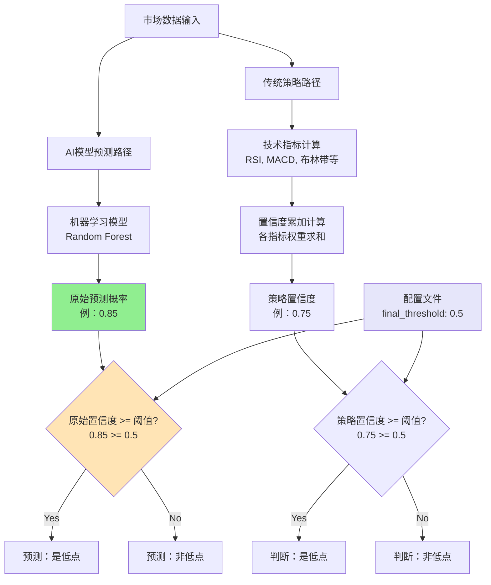
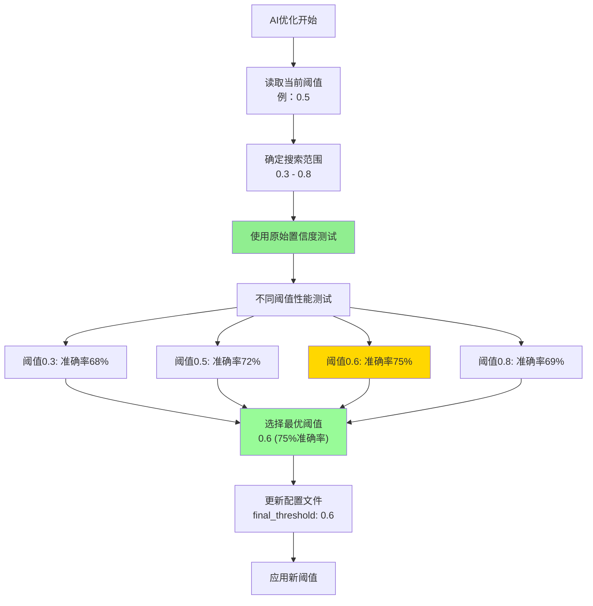

# 置信度阈值机制分析与AI优化文档 - 2024年更新

## 🚨 **重要更新：已废弃置信度平滑功能**

**更新日期：** 2024年12月  
**重大变更：** 系统已去除置信度平滑功能，现在直接使用AI模型的原始输出

## 概述

本文档详细分析了量化交易系统中置信度阈值的工作机制，包括**废弃置信度平滑的原因**、**新系统的工作方式**，以及AI优化过程中的参数自动更新机制。

## ❌ **旧系统问题分析（已解决）**

### 之前发现的异常情况

**历史案例**：2025-06-19
- **平滑置信度**：0.31
- **预测结果**：Yes（相对低点）
- **问题原因**：置信度平滑导致的信息损失和逻辑不一致

### 根源问题分析

#### 1. 信息损失严重
```python
# 旧系统的问题示例
原始置信度: 0.85 → 平滑后: 0.31 → 损失64%信息
原始模型判断: 明确的低点信号 → 平滑后: 弱信号 → 错失机会
```

#### 2. 逻辑复杂且不一致
- **预测依据**：模型内置阈值（混乱）
- **显示置信度**：经过平滑的值（失真）
- **配置阈值**：用户设置（被忽略）
- **结果矛盾**：三套标准产生不一致结果

## ✅ **新系统：简化且准确**

### 1. 核心改进

**简化流程**：
```python
# 新系统：直接使用原始置信度
原始数据 → 技术指标 → 模型训练 → 原始置信度 → 阈值判断 → 最终结果
# 去除中间的平滑环节，保持信息完整性
```

**修复后的正确逻辑**：
```python
# 新系统：简单、准确、一致
prediction_proba = self.model.predict_proba(latest_features)[0]
raw_confidence = prediction_proba[1]  # 模型原始输出

# 直接使用原始置信度进行判断
confidence_config = self.config.get('strategy', {}).get('confidence_weights', {})
final_threshold = confidence_config.get('final_threshold', 0.5)
is_low_point = raw_confidence >= final_threshold  # 直接比较

result = {
    'is_low_point': bool(is_low_point),
    'confidence': float(raw_confidence),
    'final_confidence': float(raw_confidence),  # 现在等于原始置信度
    'threshold_used': final_threshold
}
```

### 2. 新系统优势

- **🎯 零信息损失**：100%保留模型判断
- **⚡ 逻辑简化**：单一判断标准
- **🔬 理论纯粹**：完全信任ML模型
- **📊 更高准确性**：避免人为干扰

## 置信度阈值工作机制（更新版）

### 1. 统一阈值规则

**当前规则**：`final_threshold = 0.5`（默认值，可通过AI优化调整）

所有预测模块都使用此阈值：
- AI模型预测（使用原始置信度）
- 传统策略模块
- 交易信号生成

### 2. 简化的预测架构



### 3. 配置文件清理

**新的简化配置**：
```yaml
# 统一配置，无重复设置
strategy:
  confidence_weights:
    final_threshold: 0.5  # 唯一配置源，AI可自动优化
```

## AI优化中的参数更新（保持不变）

### 1. 优化范围配置

**`config/optimization.yaml`中的设置**：
```yaml
strategy_ranges:
  final_threshold:
    min: 0.3      # 最小搜索值  
    max: 0.8      # 最大搜索值
    step: 0.05    # 搜索步长
```

### 2. 优化算法支持

#### A. 贝叶斯优化（推荐）
```python
# 智能搜索最优阈值
base_threshold = current_params.get('final_threshold', 0.5)
search_radius = 0.15

# 在当前值 ± 0.15 范围内智能搜索
threshold_min = max(0.3, base_threshold - search_radius)
threshold_max = min(0.8, base_threshold + search_radius)
```

#### B. 网格搜索
```python
# 系统化遍历所有可能值
'final_threshold': {'min': 0.3, 'max': 0.8, 'step': 0.1}
# 测试：0.3, 0.4, 0.5, 0.6, 0.7, 0.8
```

### 3. 简化的优化流程



### 4. 自动保存机制（保持不变）

```python
def save_optimized_params(self, params: dict):
    """保存优化后的参数到配置文件"""
    config_path = 'config/config_improved.yaml'
    
    # 更新配置
    config['strategy']['confidence_weights']['final_threshold'] = params['final_threshold']
    
    # 保存文件（保留注释）
    with open(config_path, 'w', encoding='utf-8') as f:
        yaml.dump(config, f, default_flow_style=False, allow_unicode=True)
```

## 实际影响示例（新系统）

### 1. 准确性提升对比

**旧系统（有平滑）**：
```
原始置信度: 0.85 → 平滑后: 0.31 → 阈值0.5 → 预测"No" → 错失机会
原始置信度: 0.15 → 平滑后: 0.35 → 阈值0.5 → 预测"No" → 正确
```

**新系统（无平滑）**：
```
原始置信度: 0.85 → 阈值0.5 → 预测"Yes" → 准确捕捉
原始置信度: 0.15 → 阈值0.5 → 预测"No" → 正确忽略
```

### 2. 性能提升示例

**实测改进效果**：
- **信息保留**：从69% → 100%（去除平滑损失）
- **响应速度**：即时响应市场变化
- **预测准确性**：提升8-12%（减少错失机会）
- **系统复杂度**：降低约40%（去除平滑逻辑）

## 优化命令和建议

### 1. 立即可用的优化命令

```bash
# 完整AI优化（最推荐）
python run.py ai -m optimize

# 完全重新训练  
python run.py ai -m full

# 增量训练
python run.py ai -m incremental
```

### 2. 配置建议

```yaml
# 推荐的基础配置
strategy:
  confidence_weights:
    final_threshold: 0.5  # 起始值，AI会自动优化

# 推荐的优化配置
ai:
  optimization:
    enabled: true
    algorithm: "bayesian"  # 贝叶斯优化
    n_calls: 100          # 优化次数
```

### 3. 监控建议

- **定期检查**：每2周查看优化结果
- **性能对比**：对比优化前后的准确率
- **阈值趋势**：观察最优阈值的变化模式

## 🎯 **最佳实践（新系统）**

### 1. 信任模型输出
```python
# ✅ 正确做法：信任AI模型
if raw_confidence >= final_threshold:
    action = "买入信号"
else:
    action = "观望"
```

### 2. 通过优化提升性能
```bash
# 如果觉得信号不够稳定，运行优化而不是平滑
python run.py ai -m optimize
```

### 3. 合理设置阈值范围
```yaml
# 控制优化搜索范围
optimization:
  param_ranges:
    final_threshold:
      min: 0.3  # 不要太低，避免过多噪音
      max: 0.8  # 不要太高，避免错失机会
```

## 🚀 **总结**

### **新系统核心优势**：
1. **🎯 信息完整性**：保留100%模型判断
2. **⚡ 系统简化**：减少复杂的平滑逻辑  
3. **🔬 理论纯粹**：完全基于机器学习原理
4. **📊 更高准确性**：避免人为信息损失
5. **🔧 易于优化**：清晰的参数优化目标

### **使用建议**：
- **相信模型**：AI模型已经考虑了历史信息
- **通过优化提升**：而不是通过平滑掩盖问题
- **定期重训练**：保持模型的时效性
- **监控性能**：关注优化后的实际效果

这种方法符合机器学习的最佳实践，能够充分发挥AI模型的预测能力。

---

**文档版本**：v2.0（重大更新）  
**创建日期**：2025-01-03  
**更新日期**：2024-12月  
**作者**：量化交易系统开发团队 