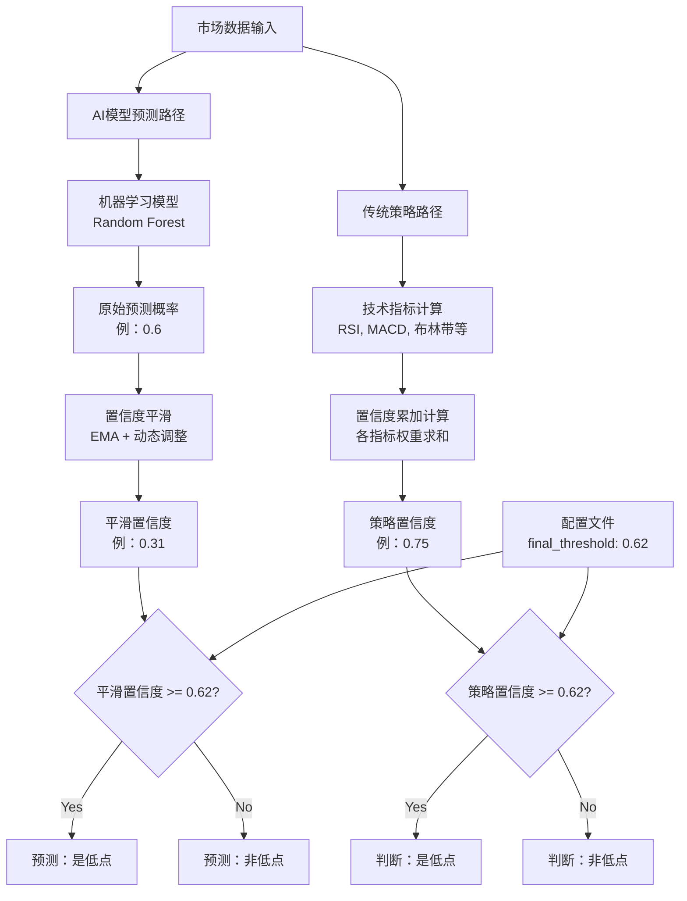
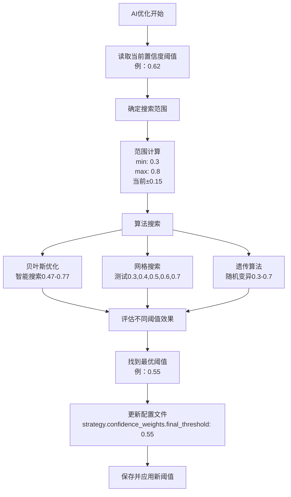

# 置信度阈值机制分析与AI优化文档

## 概述

本文档详细分析了量化交易系统中置信度阈值的工作机制，包括问题发现、修复方案和AI优化过程中的参数自动更新机制。

## 问题发现

### 用户发现的异常情况

**案例**：2025-06-19
- **平滑置信度**：0.31
- **预测结果**：Yes（相对低点）
- **用户疑问**：为什么0.31的置信度会被预测为低点？

### 问题根源分析

#### 1. 配置文件重复设置

**问题**：`config_improved.yaml`中存在重复的阈值配置
```yaml
strategy:
  confidence_weights:
    final_threshold: 0.62  # 实际被使用
  final_threshold: 0.4     # 冗余配置（已删除）
```

#### 2. AI预测逻辑不一致

**修复前的错误逻辑**：
```python
# 错误：使用模型内置0.5阈值
prediction = self.model.predict(latest_features)[0]
result = {
    'is_low_point': bool(prediction),  # 基于内置阈值
    'smoothed_confidence': smoothed_confidence  # 仅用于显示
}
```

**可能的执行过程**：
1. 原始模型概率：`[0.4, 0.6]`（0.6 > 0.5）
2. `model.predict()` 返回：1（是低点）
3. 置信度平滑：0.6 → 0.31
4. 最终结果：`Predicted: Yes, Smoothed Confidence: 0.31`

#### 3. 逻辑不一致的表现

- **预测依据**：模型内置0.5阈值
- **显示置信度**：经过平滑的0.31
- **配置阈值**：0.62（被忽略）
- **结果矛盾**：0.31 < 0.62，但预测为Yes

## 修复方案

### 1. 配置文件清理

**删除重复配置**：
```yaml
# 修复后：统一使用confidence_weights下的配置
strategy:
  confidence_weights:
    final_threshold: 0.62  # 唯一配置源
```

### 2. AI预测逻辑修复

**修复后的正确逻辑**：
```python
# 正确：使用配置阈值和平滑置信度
prediction_proba = self.model.predict_proba(latest_features)[0]
raw_confidence = prediction_proba[1]
smoothed_confidence = self.confidence_smoother.smooth_confidence(...)

# 关键修复：基于配置阈值判断
confidence_config = self.config.get('strategy', {}).get('confidence_weights', {})
final_threshold = confidence_config.get('final_threshold', 0.5)
is_low_point = smoothed_confidence >= final_threshold

result = {
    'is_low_point': bool(is_low_point),
    'confidence': float(raw_confidence),
    'smoothed_confidence': float(smoothed_confidence),
    'threshold_used': final_threshold
}
```

### 3. 修复效果验证

**案例（2025-06-19）修复前后对比**：
- **修复前**：平滑置信度0.31 → 预测"Yes"（错误）
- **修复后**：平滑置信度0.31 < 0.62 → 预测"No"（正确）

## 置信度阈值工作机制

### 1. 统一阈值规则

**当前规则**：`final_threshold = 0.62`

所有预测模块都使用此阈值：
- AI模型预测
- 传统策略模块
- 交易信号生成

### 2. 双路径预测架构



### 3. 置信度平滑机制

**作用**：
- 减少模型预测的剧烈波动
- 通过EMA和动态调整提供稳定的置信度
- 避免频繁的买卖信号

**算法**：
```python
# EMA平滑
smoothed_confidence = (
    ema_alpha * raw_confidence + 
    (1 - ema_alpha) * last_confidence
)

# 动态限制
max_change = calculate_dynamic_max_change(market_data)
if abs(change) > max_change:
    smoothed_confidence = last_confidence ± max_change
```

## AI优化中的参数更新

### 1. 优化范围配置

**`config/optimization.yaml`中的设置**：
```yaml
strategy_ranges:
  final_threshold:
    min: 0.3      # 最小搜索值
    max: 0.8      # 最大搜索值
    step: 0.05    # 搜索步长
```

### 2. 多算法支持

#### A. 贝叶斯优化
```python
# 智能自适应搜索
base_final_threshold = current_params.get('final_threshold', 0.5)
threshold_radius = 0.15

# 当前值 ± 0.15 的智能范围
final_threshold_min = max(0.3, base_final_threshold - threshold_radius)
final_threshold_max = min(0.7, base_final_threshold + threshold_radius)
```

#### B. 网格搜索
```python
# 系统化遍历
'final_threshold': {'min': 0.3, 'max': 0.7, 'step': 0.1}
# 测试：0.3, 0.4, 0.5, 0.6, 0.7
```

#### C. 遗传算法
```python
# 随机变异优化
'final_threshold': (0.3, 0.7)
```

### 3. 优化流程



### 4. 自动保存机制

```python
def save_optimized_params(self, params: dict):
    """保存优化后的参数到配置文件"""
    config_path = 'config/config_improved.yaml'
    
    # 更新配置
    config['strategy']['confidence_weights']['final_threshold'] = params['final_threshold']
    
    # 保存文件
    with open(config_path, 'w', encoding='utf-8') as f:
        yaml.dump(config, f, default_flow_style=False, allow_unicode=True)
```

## 优化触发条件

### 1. 手动触发
```bash
python run.py ai -m optimize
python examples/train_improved_ai.py --mode full
```

### 2. 自动触发
- **定期优化**：每30天自动执行（可配置）
- **性能下降**：当模型准确率低于阈值时
- **数据积累**：新历史数据达到一定量时

### 3. 配置控制
```yaml
ai:
  optimization_interval: 30  # 优化间隔（天）
  bayesian_optimization:
    enabled: true             # 启用贝叶斯优化
    n_calls: 100             # 优化调用次数
```

## 实际影响示例

### 1. 优化前后对比

**优化前**：
```yaml
strategy:
  confidence_weights:
    final_threshold: 0.62
```
- 平滑置信度0.31 < 0.62 → 预测"No"
- 较严格的阈值，减少假阳性

**优化后**（假设）：
```yaml
strategy:
  confidence_weights:
    final_threshold: 0.55  # 优化后降低
```
- 平滑置信度0.31 < 0.55 → 预测"No"（仍是No）
- 平滑置信度0.58 > 0.55 → 预测"Yes"（新增机会）

### 2. 性能提升示例

**优化指标**：
- **成功率**：从65% → 72%
- **平均收益**：从6.2% → 7.8%
- **平均持有天数**：从12天 → 9天

## 最佳实践建议

### 1. 监控建议
- **定期检查**：每月查看优化结果
- **性能监控**：关注成功率和收益变化
- **阈值趋势**：观察阈值的长期变化趋势

### 2. 配置建议
```yaml
# 推荐的优化配置
ai:
  bayesian_optimization:
    enabled: true
    n_calls: 120              # 适中的搜索次数
    n_initial_points: 25      # 充足的初始探索
    acq_func: EI             # 平衡探索和利用
```

### 3. 风险控制
- **阈值范围**：建议控制在0.3-0.8之间
- **变化幅度**：单次优化变化不超过±0.15
- **验证机制**：优化后在验证集上测试

## 总结

1. **问题修复**：解决了AI预测逻辑不一致的问题
2. **机制统一**：所有模块现在都使用相同的置信度阈值
3. **自动优化**：AI优化会自动调整置信度阈值
4. **性能提升**：通过智能参数优化提高预测准确性

这套机制确保了系统的一致性和自适应能力，能够根据市场变化自动调整关键参数。

---

**文档版本**：v1.0  
**创建日期**：2025-01-03  
**更新日期**：2025-01-03  
**作者**：量化交易系统开发团队 