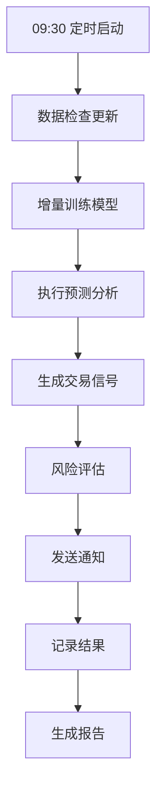

# 日常交易流程集成指南

## 🚀 系统概述

日常交易机器人是一个完全自动化的AI量化交易系统，集成了：
- 🤖 **增量学习**：每日自动更新AI模型
- 🔮 **智能预测**：使用改进版AI预测相对低点
- 📈 **信号生成**：自动生成交易信号和建议
- 📊 **风险控制**：内置多层风险管理机制
- 📱 **智能通知**：重要信号自动推送
- 📝 **完整记录**：所有操作和结果自动记录

## 📋 快速开始

### 1️⃣ **一键启动（推荐）**

**Windows用户：**
```bash
# 双击运行
scripts\start_trading_bot.bat
```

**Linux/Mac用户：**
```bash
# 添加执行权限（首次）
chmod +x scripts/start_trading_bot.sh

# 运行
./scripts/start_trading_bot.sh
```

### 2️⃣ **命令行运行**

```bash
# 单次执行（立即执行一次完整流程）
python scripts/daily_trading_bot.py --mode run

# 定时执行（每天9:30自动执行）
python scripts/daily_trading_bot.py --mode schedule

# 查看状态
python scripts/daily_trading_bot.py --mode status
```

### 3️⃣ **手动操作**

```bash
# 手动增量训练
python examples/train_improved_ai.py --mode incremental

# 手动预测
python examples/train_improved_ai.py --mode demo

# 运行演示
python examples/demo_improved_ai.py
```

## 🔄 完整工作流程

### **每日自动执行流程**



### **详细步骤说明**

#### **步骤1: 数据检查和更新** 📊
- 检查最新数据可用性
- 验证数据完整性和时效性
- 记录数据状态

#### **步骤2: 增量训练** 🤖
- 智能判断是否需要重训练
- 使用最近30天数据进行增量更新
- 保持模型连续性和稳定性

#### **步骤3: 执行预测** 🔮
- 使用最新100天数据进行预测
- 应用置信度平滑机制
- 输出稳定的预测结果

#### **步骤4: 生成交易信号** 📈
根据预测结果和置信度自动生成5种信号：

| 信号类型 | 置信度要求 | 建议仓位 | 风险等级 |
|---------|-----------|---------|---------|
| 🔥 强烈买入 | ≥0.8 | 30% | 低 |
| ✅ 买入 | ≥0.6 | 20% | 低 |
| ⚠️ 弱买入 | ≥0.4 | 10% | 中 |
| 👀 观望 | ≥0.2 | 0% | 高 |
| 💤 等待 | <0.2 | 0% | 中 |

#### **步骤5: 风险控制** 🛡️
- 自动止损设置（5%）
- 自动止盈设置（15%）
- 仓位管理控制
- 连续错误处理

#### **步骤6: 通知发送** 📱
- 重要信号立即通知
- 日常总结定时推送
- 风险警告及时提醒

## 📊 监控和管理

### **实时状态监控**

```bash
# 查看机器人状态
python scripts/daily_trading_bot.py --mode status
```

**状态信息包括：**
- 总预测次数和成功率
- 最近训练和预测时间
- 连续错误次数
- 系统运行状态

### **历史记录查看**

**文件位置：**
- 🗂️ **交易历史**：`results/daily_trading/trading_history.json`
- 📝 **日报告**：`results/daily_trading/daily_report_YYYY-MM-DD.md`
- 📊 **机器人状态**：`results/daily_trading/bot_state.json`
- 📋 **日志文件**：`logs/daily_trading_bot.log`

### **报告分析**

每日自动生成的报告包含：
- ✅ **执行摘要**：整体状态和成功率
- 🤖 **AI预测结果**：置信度和预测结果
- 📈 **交易信号**：具体建议和强度
- 🔄 **模型训练**：训练状态和方式
- 📊 **统计信息**：累计统计数据

## ⚙️ 配置定制

### **基础配置**

修改 `config/config_improved.yaml`：

```yaml
ai:
  confidence_smoothing:
    max_daily_change: 0.35        # 置信度变化限制
    dynamic_adjustment:
      enabled: true               # 动态调整开关
```

### **交易策略配置**

修改 `config/trading_strategy.yaml`：

```yaml
trading:
  signal_rules:
    buy_strong:
      confidence_min: 0.8         # 强买信号阈值
      position_ratio: 0.3         # 建议仓位
  
  risk_management:
    stop_loss:
      max_loss_ratio: 0.05        # 止损比例
    take_profit:
      target_profit_ratio: 0.15   # 止盈比例
```

### **通知设置**

修改配置文件中的通知部分：

```yaml
notification:
  methods:
    - console                     # 控制台通知
    - email                       # 邮件通知（需配置）
```

## 🕐 定时任务设置

### **方式一：使用内置调度器**

```bash
# 启动定时任务（推荐）
python scripts/daily_trading_bot.py --mode schedule
```

- ⏰ **执行时间**：每天9:30
- 🔄 **自动重启**：程序异常时自动恢复
- 📱 **实时监控**：执行状态实时显示

### **方式二：系统定时任务**

**Windows任务计划程序：**
1. 打开"任务计划程序"
2. 创建基本任务
3. 设置触发器：每天9:30
4. 设置操作：运行 `scripts\start_trading_bot.bat`

**Linux/Mac Cron：**
```bash
# 编辑crontab
crontab -e

# 添加定时任务（每天9:30执行）
30 9 * * * cd /path/to/csi1000_quant && python scripts/daily_trading_bot.py --mode run
```

## 🔧 高级功能

### **1. 手动干预**

```bash
# 强制重新训练
python examples/train_improved_ai.py --mode full

# 指定日期预测
python examples/train_improved_ai.py --mode demo --date 2025-06-28
```

### **2. 批量回测**

```bash
# 运行改进效果对比
python examples/test_improvements.py

# 分析置信度限制
python examples/confidence_limit_analysis.py
```

### **3. 参数优化**

```bash
# 运行参数优化
python run.py ai -m optimize
```

### **4. 数据管理**

```bash
# 获取最新数据
python scripts/fetch_latest_data.py

# 重置参数
python scripts/reset_parameters.py
```

## 📈 使用策略建议

### **新手策略**

1. **保守参数**：
   - 置信度阈值：≥0.6
   - 最大仓位：20%
   - 止损设置：3%

2. **建议操作**：
   - 每周检查一次状态
   - 只在强买信号时操作
   - 严格执行止损

### **进阶策略**

1. **平衡参数**：
   - 置信度阈值：≥0.4
   - 最大仓位：50%
   - 止损设置：5%

2. **建议操作**：
   - 每日查看信号
   - 分批建仓策略
   - 动态调整仓位

### **专业策略**

1. **积极参数**：
   - 置信度阈值：≥0.3
   - 最大仓位：80%
   - 止损设置：7%

2. **建议操作**：
   - 实时监控信号
   - 多品种分散投资
   - 量化风险管理

## ⚠️ 风险提示

### **系统风险**

1. **模型风险**：AI预测基于历史数据，未来可能失效
2. **技术风险**：系统故障可能导致错失机会
3. **数据风险**：数据质量直接影响预测准确性

### **交易风险**

1. **市场风险**：市场环境变化可能导致策略失效
2. **流动性风险**：极端市场条件下可能无法及时交易
3. **操作风险**：错误操作可能导致损失

### **风险控制**

1. **资金管理**：
   - 不要投入超过可承受损失的资金
   - 分散投资，不要集中单一品种
   - 保持充足的现金储备

2. **心理控制**：
   - 严格执行止损策略
   - 不要因短期波动改变策略
   - 保持理性投资心态

3. **持续学习**：
   - 定期评估策略效果
   - 关注市场环境变化
   - 及时调整参数设置

## 🆘 故障排除

### **常见问题**

#### **Q1: 定时任务不执行**
```bash
# 检查调度器状态
python scripts/daily_trading_bot.py --mode status

# 手动执行测试
python scripts/daily_trading_bot.py --mode run
```

#### **Q2: 预测结果异常**
```bash
# 重新训练模型
python examples/train_improved_ai.py --mode full

# 检查数据质量
python examples/test_improvements.py
```

#### **Q3: 通知不发送**
- 检查配置文件中的通知设置
- 查看日志文件了解错误信息
- 确认网络连接正常

#### **Q4: 置信度变化过大**
```bash
# 分析置信度设置
python examples/confidence_limit_analysis.py

# 调整平滑参数
# 修改 config/config_improved.yaml 中的 max_daily_change
```

### **日志分析**

**主要日志文件：**
- `logs/daily_trading_bot.log`：机器人运行日志
- `logs/system.log`：系统运行日志
- `results/daily_trading/`：交易结果记录

**日志级别：**
- INFO：正常运行信息
- WARNING：警告信息
- ERROR：错误信息

## 📞 支持和反馈

### **获取帮助**

1. **查看文档**：`docs/` 目录下的详细文档
2. **运行示例**：`examples/` 目录下的示例脚本
3. **检查日志**：`logs/` 目录下的日志文件

### **性能优化**

1. **硬件优化**：
   - 使用SSD存储提高I/O性能
   - 增加内存减少数据交换
   - 使用多核CPU提高计算速度

2. **软件优化**：
   - 定期清理历史记录
   - 优化模型参数
   - 调整数据获取频率

### **更新和维护**

1. **定期更新**：
   - 关注模型性能变化
   - 及时更新依赖包
   - 定期备份重要数据

2. **性能监控**：
   - 监控预测成功率
   - 分析错误模式
   - 优化策略参数

---

## 🎯 开始使用

**第一次使用：**

1. **确保模型已训练**：
   ```bash
   python examples/train_improved_ai.py --mode full
   ```

2. **测试单次执行**：
   ```bash
   python scripts/daily_trading_bot.py --mode run
   ```

3. **启动定时任务**：
   ```bash
   python scripts/daily_trading_bot.py --mode schedule
   ```

4. **享受自动化交易**！🚀

**恭喜您！现在拥有了一个完全自动化的AI量化交易系统！** 