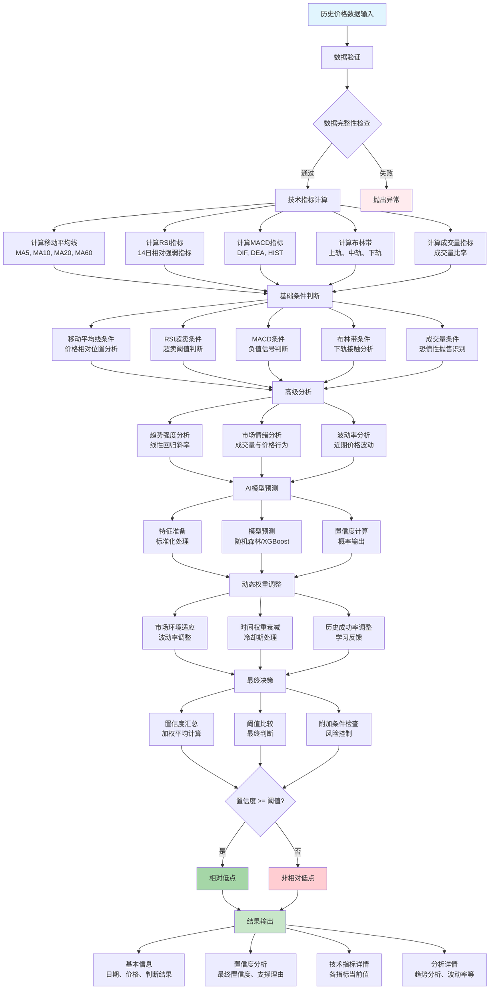

# 相对低点计算流程介绍

相对低点识别是本项目的核心算法，通过多层次技术指标分析和AI模型预测，智能识别股票价格的相对低点。本文档详细介绍相对低点计算的完整流程。

## 算法流程图



### 流程图说明

相对低点计算流程分为**8个主要阶段**：

1. **数据输入与验证**：确保输入数据的完整性和正确性
2. **技术指标计算**：计算MA、RSI、MACD、布林带等关键技术指标
3. **基础条件判断**：基于技术指标进行初步的条件筛选
4. **高级分析**：进行趋势强度、市场情绪、波动率等深入分析
5. **AI模型预测**：利用机器学习模型进行智能预测
6. **动态权重调整**：根据市场环境和历史表现调整各指标权重
7. **最终决策**：综合所有信息进行最终的相对低点判断
8. **结果输出**：生成包含详细分析的结构化结果

**关键决策点**：置信度阈值比较是整个流程的核心，决定了最终是否判定为相对低点。

**颜色说明**：
- 🔵 蓝色：数据输入阶段
- 🟢 绿色：成功输出
- 🔴 红色：失败或异常处理

## 算法概述

### 核心思想
相对低点不是绝对的最低价格，而是在一定时间窗口内，具有较高上涨概率的价格位置。算法通过以下维度综合判断：

1. **技术指标信号**：多种技术指标的超卖信号
2. **价格位置分析**：价格在均线系统中的相对位置
3. **成交量分析**：成交量变化反映的市场情绪
4. **AI模型预测**：机器学习模型的智能预测
5. **动态权重调整**：根据市场环境动态调整各指标权重

### 输入数据
- **历史价格数据**：开盘价、最高价、最低价、收盘价
- **成交量数据**：成交量和成交额
- **技术指标**：MA、RSI、MACD、布林带等预计算指标

### 输出结果
- **是否为相对低点**：布尔值判断结果
- **置信度分数**：0-1之间的数值，表示预测确信程度
- **支撑理由**：详细的判断依据说明

## 详细计算流程

### 第一步：数据预处理

#### 1.1 数据验证
```python
def validate_input_data(data):
    # 检查数据完整性
    required_columns = ['date', 'open', 'high', 'low', 'close', 'volume']
    missing_columns = [col for col in required_columns if col not in data.columns]
    
    if missing_columns:
        raise ValueError(f"缺失必要字段: {missing_columns}")
    
    # 检查数据合理性
    if (data['high'] < data['low']).any():
        raise ValueError("最高价不能小于最低价")
    
    if (data['close'] <= 0).any() or (data['volume'] < 0).any():
        raise ValueError("价格或成交量数据异常")
    
    return True
```

#### 1.2 技术指标计算
```python
def calculate_technical_indicators(data):
    # 移动平均线
    data['ma5'] = data['close'].rolling(5).mean()
    data['ma10'] = data['close'].rolling(10).mean()
    data['ma20'] = data['close'].rolling(20).mean()
    data['ma60'] = data['close'].rolling(60).mean()
    
    # RSI指标
    delta = data['close'].diff()
    gain = (delta.where(delta > 0, 0)).rolling(14).mean()
    loss = (-delta.where(delta < 0, 0)).rolling(14).mean()
    rs = gain / loss
    data['rsi'] = 100 - (100 / (1 + rs))
    
    # MACD指标
    ema12 = data['close'].ewm(span=12).mean()
    ema26 = data['close'].ewm(span=26).mean()
    data['macd'] = ema12 - ema26
    data['signal'] = data['macd'].ewm(span=9).mean()
    data['hist'] = data['macd'] - data['signal']
    
    # 布林带
    data['bb_middle'] = data['close'].rolling(20).mean()
    bb_std = data['close'].rolling(20).std()
    data['bb_upper'] = data['bb_middle'] + (bb_std * 2)
    data['bb_lower'] = data['bb_middle'] - (bb_std * 2)
    
    # 成交量相关指标
    data['volume_ma20'] = data['volume'].rolling(20).mean()
    data['volume_ratio'] = data['volume'] / data['volume_ma20']
    
    # 价格变化率
    data['price_change'] = data['close'].pct_change()
    data['price_change_5d'] = data['close'].pct_change(5)
    
    return data
```

### 第二步：基础条件判断

#### 2.1 移动平均线条件
```python
def check_ma_conditions(latest_data, config):
    close = latest_data['close']
    ma5 = latest_data['ma5']
    ma10 = latest_data['ma10']
    ma20 = latest_data['ma20']
    
    confidence = 0.0
    reasons = []
    
    # 条件1：价格跌破所有均线
    if close < ma5 and close < ma10 and close < ma20:
        base_confidence = config['confidence_weights']['ma_all_below']
        
        # 成交量分析增强判断
        volume_ratio = latest_data['volume_ratio']
        price_decline = latest_data['price_change']
        
        if volume_ratio > config['volume_panic_threshold'] and price_decline < config['price_decline_threshold']:
            # 恐慌性抛售，可能是见底信号
            confidence += base_confidence + config['volume_panic_bonus']
            reasons.append(f"价格跌破所有均线+恐慌性抛售(成交量放大{volume_ratio:.1f}倍)")
        elif volume_ratio > config['volume_surge_threshold']:
            # 温和放量
            confidence += base_confidence + config['volume_surge_bonus']
            reasons.append(f"价格跌破所有均线+温和放量")
        elif volume_ratio < config['volume_shrink_threshold']:
            # 成交量萎缩，可能还在下跌通道
            confidence += base_confidence * config['volume_shrink_penalty']
            reasons.append("价格跌破所有均线+成交量萎缩(可能仍在下跌)")
        else:
            confidence += base_confidence
            reasons.append("价格跌破所有均线")
    
    # 条件2：部分跌破均线
    elif close < ma10 and close < ma20:
        confidence += config['confidence_weights']['ma_partial_below']
        reasons.append("价格跌破中长期均线")
    
    return confidence, reasons
```

#### 2.2 RSI超卖条件
```python
def check_rsi_conditions(latest_data, config):
    rsi = latest_data['rsi']
    confidence = 0.0
    reasons = []
    
    if rsi < config['rsi_oversold_threshold']:
        # 严重超卖
        confidence += config['confidence_weights']['rsi_oversold']
        reasons.append(f"RSI严重超卖({rsi:.2f})")
    elif rsi < config['rsi_low_threshold']:
        # 偏低水平
        confidence += config['confidence_weights']['rsi_low']
        reasons.append(f"RSI偏低({rsi:.2f})")
    
    return confidence, reasons
```

#### 2.3 布林带条件
```python
def check_bollinger_conditions(latest_data, config):
    close = latest_data['close']
    bb_lower = latest_data['bb_lower']
    
    confidence = 0.0
    reasons = []
    
    # 价格接近或触及布林带下轨
    if close <= bb_lower * config['bb_near_threshold']:
        confidence += config['confidence_weights']['bb_lower_near']
        
        # 计算偏离程度
        deviation = (close - bb_lower) / bb_lower
        if deviation < -0.02:  # 跌破下轨2%
            confidence += 0.05  # 额外加分
            reasons.append(f"价格跌破布林带下轨{abs(deviation)*100:.1f}%")
        else:
            reasons.append("价格接近布林带下轨")
    
    return confidence, reasons
```

### 第三步：高级分析

#### 3.1 趋势强度分析
```python
def analyze_trend_strength(data, window=20):
    """计算趋势强度"""
    if len(data) < window:
        return 0.0
    
    # 使用线性回归计算趋势斜率
    prices = data['close'].tail(window).values
    x = np.arange(len(prices))
    
    # 计算斜率和R²
    slope, intercept = np.polyfit(x, prices, 1)
    predicted = slope * x + intercept
    r_squared = 1 - (np.sum((prices - predicted) ** 2) / 
                    np.sum((prices - np.mean(prices)) ** 2))
    
    # 标准化斜率
    normalized_slope = slope / np.mean(prices)
    
    # 趋势强度 = |标准化斜率| × R²
    trend_strength = abs(normalized_slope) * r_squared
    
    return {
        'slope': slope,
        'normalized_slope': normalized_slope,
        'r_squared': r_squared,
        'trend_strength': trend_strength,
        'direction': 'down' if slope < 0 else 'up'
    }
```

#### 3.2 市场情绪分析
```python
def analyze_market_sentiment(data, config):
    """基于成交量和价格行为分析市场情绪"""
    
    # 近期成交量分析
    recent_volume_avg = data['volume'].tail(5).mean()
    historical_volume_avg = data['volume'].tail(20).mean()
    volume_ratio = recent_volume_avg / historical_volume_avg
    
    # 价格动量分析
    recent_returns = data['close'].pct_change().tail(5)
    volatility = recent_returns.std()
    avg_return = recent_returns.mean()
    
    confidence_adjustment = 0.0
    reasons = []
    
    # 情绪分类
    if volume_ratio > 1.5 and avg_return < -0.02:
        # 恐慌性抛售
        confidence_adjustment += config['market_sentiment_weight']
        reasons.append(f"恐慌性抛售情绪(成交量激增{volume_ratio:.1f}倍)")
    elif volume_ratio > 1.2:
        # 关注度提升
        confidence_adjustment += config['market_sentiment_weight'] * 0.6
        reasons.append(f"市场关注度提升")
    elif volume_ratio < 0.7:
        # 观望情绪
        confidence_adjustment += config['market_sentiment_weight'] * 0.3
        reasons.append("市场观望情绪浓厚")
    
    return confidence_adjustment, reasons
```

### 第四步：AI模型预测

#### 4.1 特征准备
```python
def prepare_ai_features(data):
    """为AI模型准备特征"""
    latest_data = data.iloc[-1]
    
    features = []
    feature_names = []
    
    # 价格相关特征
    for ma_period in [5, 10, 20, 60]:
        if f'ma{ma_period}' in data.columns:
            # 价格与均线距离
            distance = (latest_data['close'] - latest_data[f'ma{ma_period}']) / latest_data[f'ma{ma_period}']
            features.append(distance)
            feature_names.append(f'dist_ma{ma_period}')
    
    # 技术指标特征
    indicator_features = ['rsi', 'macd', 'signal', 'hist']
    for feature in indicator_features:
        if feature in data.columns and not pd.isna(latest_data[feature]):
            features.append(latest_data[feature])
            feature_names.append(feature)
    
    # 布林带相关
    if 'bb_lower' in data.columns:
        bb_position = (latest_data['close'] - latest_data['bb_lower']) / (latest_data['bb_upper'] - latest_data['bb_lower'])
        features.append(bb_position)
        feature_names.append('bb_position')
    
    # 成交量特征
    features.append(latest_data['volume_ratio'])
    feature_names.append('volume_ratio')
    
    # 波动率特征
    if len(data) >= 20:
        volatility = data['close'].pct_change().tail(20).std()
        features.append(volatility)
        feature_names.append('volatility')
    
    return np.array(features).reshape(1, -1), feature_names
```

#### 4.2 AI预测执行
```python
def ai_prediction(data, ai_model):
    """执行AI预测"""
    if ai_model is None:
        return 0.0, "AI模型未加载"
    
    try:
        # 准备特征
        features, feature_names = prepare_ai_features(data)
        
        # 模型预测
        prediction_proba = ai_model.predict_proba(features)[0]
        ai_confidence = prediction_proba[1] if len(prediction_proba) > 1 else 0.0
        
        # 特征重要性分析
        if hasattr(ai_model, 'feature_importances_'):
            importances = ai_model.feature_importances_
            top_features = sorted(zip(feature_names, importances), 
                                key=lambda x: x[1], reverse=True)[:3]
            reason = f"AI预测置信度{ai_confidence:.3f}，主要特征：{top_features[0][0]}"
        else:
            reason = f"AI预测置信度{ai_confidence:.3f}"
        
        return ai_confidence, reason
        
    except Exception as e:
        return 0.0, f"AI预测失败: {str(e)}"
```

### 第五步：动态权重调整

#### 5.1 市场环境适应
```python
def dynamic_weight_adjustment(data, config):
    """根据市场环境动态调整权重"""
    
    # 波动率分析
    if len(data) >= 20:
        returns = data['close'].pct_change().dropna()
        volatility = returns.std()
        
        # 高波动率时降低置信度要求
        if volatility > 0.03:
            adjustment = config['dynamic_confidence_adjustment'] * 0.5
            reason = f"高波动率环境调整(+{adjustment:.3f})"
        elif volatility < 0.015:
            adjustment = -config['dynamic_confidence_adjustment'] * 0.3
            reason = f"低波动率环境调整({adjustment:.3f})"
        else:
            adjustment = 0.0
            reason = "正常波动率，无调整"
    else:
        adjustment = 0.0
        reason = "数据不足，无调整"
    
    return adjustment, reason
```

#### 5.2 时间权重衰减
该功能用于避免频繁信号，通过时间衰减机制控制信号频率。

### 第六步：最终决策

#### 6.1 置信度汇总
```python
def calculate_final_confidence(data, config, ai_model=None):
    """计算最终置信度"""
    
    latest_data = data.iloc[-1]
    
    # 初始化
    total_confidence = 0.0
    all_reasons = []
    
    # 1. 移动平均线分析
    ma_conf, ma_reasons = check_ma_conditions(latest_data, config)
    total_confidence += ma_conf
    all_reasons.extend(ma_reasons)
    
    # 2. RSI分析
    rsi_conf, rsi_reasons = check_rsi_conditions(latest_data, config)
    total_confidence += rsi_conf
    all_reasons.extend(rsi_reasons)
    
    # 3. 布林带分析
    bb_conf, bb_reasons = check_bollinger_conditions(latest_data, config)
    total_confidence += bb_conf
    all_reasons.extend(bb_reasons)
    
    # 4. MACD分析
    if latest_data['macd'] < 0:
        total_confidence += config['confidence_weights']['macd_negative']
        all_reasons.append("MACD负值")
    
    # 5. 市场情绪分析
    sentiment_conf, sentiment_reasons = analyze_market_sentiment(data, config)
    total_confidence += sentiment_conf
    all_reasons.extend(sentiment_reasons)
    
    # 6. 动态调整
    dynamic_adj, dynamic_reason = dynamic_weight_adjustment(data, config)
    total_confidence += dynamic_adj
    all_reasons.append(dynamic_reason)
    
    # 7. AI模型预测
    if ai_model:
        ai_conf, ai_reason = ai_prediction(data, ai_model)
        # AI预测权重
        ai_weight = config.get('ai_weight', 0.3)
        total_confidence = total_confidence * (1 - ai_weight) + ai_conf * ai_weight
        all_reasons.append(ai_reason)
    
    # 限制在[0, 1]范围内
    total_confidence = max(0.0, min(1.0, total_confidence))
    
    return total_confidence, all_reasons
```

#### 6.2 最终判断
```python
def make_final_decision(total_confidence, config):
    """做出最终的相对低点判断"""
    
    threshold = config['final_threshold']
    
    # 基本判断
    is_low_point = total_confidence >= threshold
    
    # 附加条件检查
    if is_low_point:
        # 检查最小置信度要求
        min_confidence = config.get('min_confidence', 0.6)
        if total_confidence < min_confidence:
            is_low_point = False
            reason = f"置信度{total_confidence:.3f}低于最小要求{min_confidence}"
        else:
            reason = f"置信度{total_confidence:.3f}超过阈值{threshold}"
    else:
        reason = f"置信度{total_confidence:.3f}未达到阈值{threshold}"
    
    return is_low_point, reason
```

### 第七步：结果输出

#### 7.1 结果封装
```python
def generate_result(data, is_low_point, confidence, reasons, config):
    """生成最终结果"""
    
    latest_data = data.iloc[-1]
    
    result = {
        'date': latest_data['date'],
        'price': latest_data['close'],
        'is_low_point': is_low_point,
        'confidence': confidence,
        'final_confidence': confidence,  # 兼容性
        'reasons': reasons,
        'technical_indicators': {
            'ma5': latest_data.get('ma5'),
            'ma10': latest_data.get('ma10'), 
            'ma20': latest_data.get('ma20'),
            'rsi': latest_data.get('rsi'),
            'macd': latest_data.get('macd'),
            'bb_lower': latest_data.get('bb_lower'),
            'volume_ratio': latest_data.get('volume_ratio')
        },
        'analysis_details': {
            'trend_analysis': analyze_trend_strength(data),
            'volatility': data['close'].pct_change().tail(20).std() if len(data) >= 20 else None,
            'volume_analysis': {
                'current_ratio': latest_data.get('volume_ratio', 1.0),
                'avg_volume_20d': data['volume'].tail(20).mean()
            }
        }
    }
    
    return result
```

## 流程示例

### 完整计算示例
```python
def identify_relative_low_complete_example(data, config, ai_model=None):
    """完整的相对低点识别示例"""
    
    # 步骤1：数据验证
    validate_input_data(data)
    
    # 步骤2：技术指标计算
    data = calculate_technical_indicators(data)
    
    # 步骤3：计算最终置信度
    confidence, reasons = calculate_final_confidence(data, config, ai_model)
    
    # 步骤4：最终决策
    is_low_point, decision_reason = make_final_decision(confidence, config)
    reasons.append(decision_reason)
    
    # 步骤5：生成结果
    result = generate_result(data, is_low_point, confidence, reasons, config)
    
    return result
```

## 算法特点和优势

### 1. 多维度综合分析
- 技术指标、价格位置、成交量、AI预测等多个维度
- 避免单一指标的局限性

### 2. 动态权重调整
- 根据市场环境自动调整各指标权重
- 适应不同市场状态

### 3. 严格的数据验证
- 确保输入数据的质量和完整性
- 防止因数据问题导致的错误判断

### 4. 可解释的决策过程
- 提供详细的判断依据
- 便于结果分析和策略调优

### 5. 配置化设计
- 所有阈值和权重都可以通过配置文件调整
- 支持参数优化和个性化定制

## 总结

相对低点计算流程通过多层次、多维度的分析，结合传统技术指标和现代AI技术，实现了对股票价格相对低点的智能识别。该算法具有较强的适应性和可解释性，可以有效辅助投资决策。