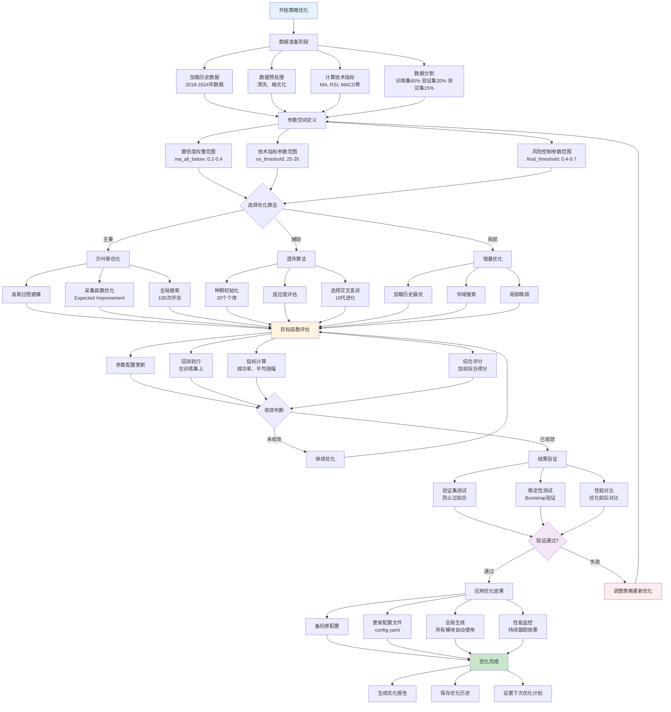

# 策略优化流程介绍

本文档详细介绍项目中策略参数优化的完整流程，包括优化算法、参数范围、评估标准等。

## 优化流程概述

策略优化是一个系统性的过程，通过多种算法寻找最优的策略参数组合，以提高相对低点识别的准确性和盈利能力。

## 策略优化流程图



### 流程图说明

策略优化流程分为**6个核心阶段**：

1. **数据准备阶段**：
   - 加载2018-2024年历史数据
   - 进行数据清洗和格式化
   - 计算所需的技术指标
   - 按65%/20%/15%比例分割训练集/验证集/测试集

2. **参数空间定义**：
   - 设置置信度权重参数范围
   - 定义技术指标参数边界
   - 确定风险控制参数范围

3. **优化算法选择**：
   - **贝叶斯优化**：主要算法，适合全局搜索
   - **遗传算法**：辅助算法，增强多样性
   - **增量优化**：局部优化，精细调参

4. **迭代优化过程**：
   - 参数配置更新
   - 回测执行和指标计算
   - 综合评分和收敛判断

5. **结果验证**：
   - 验证集测试防止过拟合
   - Bootstrap验证测试稳定性
   - 与原参数进行性能对比

6. **应用与监控**：
   - 备份原配置并更新新参数
   - 全局生效到所有模块
   - 持续监控优化效果

**关键决策点**：
- **收敛判断**：决定是否继续优化迭代
- **验证通过**：确定优化结果是否可用

**颜色说明**：
- 🔵 蓝色：开始阶段
- 🟢 绿色：成功完成
- 🟠 橙色：核心计算过程
- 🟣 紫色：验证决策点
- 🔴 红色：失败需重新优化

### 优化目标
- **最大化成功率**：提高相对低点识别的准确性
- **优化平均涨幅**：确保预测成功后的盈利幅度
- **缩短达标天数**：提高资金使用效率
- **控制风险水平**：平衡收益与风险

### 优化维度
- **技术指标参数**：MA周期、RSI阈值、MACD参数等
- **置信度权重**：各指标在最终决策中的权重
- **风险控制参数**：最小置信度、冷却期等
- **AI模型参数**：训练参数、特征权重等

## 优化算法介绍

### 1. 贝叶斯优化（主要算法）

#### 算法原理
贝叶斯优化基于高斯过程，通过建立目标函数的概率模型来指导参数搜索，能够在较少的评估次数下找到全局最优解。

#### 实现流程
```python
def bayesian_optimization():
    # 1. 初始化高斯过程
    gp = GaussianProcessRegressor()
    
    # 2. 随机采样初始点
    initial_points = random_sample(param_ranges, n_initial=20)
    
    # 3. 评估初始点
    initial_scores = [evaluate(point) for point in initial_points]
    
    # 4. 迭代优化
    for i in range(n_calls):
        # 4.1 更新高斯过程
        gp.fit(evaluated_points, scores)
        
        # 4.2 采集函数选择下一个点
        next_point = acquisition_function(gp, param_ranges)
        
        # 4.3 评估新点
        score = evaluate(next_point)
        
        # 4.4 更新历史
        evaluated_points.append(next_point)
        scores.append(score)
    
    return best_point, best_score
```

#### 配置参数
```yaml
bayesian_optimization:
  n_calls: 100              # 最大评估次数
  n_initial_points: 20      # 初始随机点数量
  acq_func: "EI"           # 采集函数（Expected Improvement）
  xi: 0.01                 # 探索参数
  kappa: 1.96              # UCB参数
```

### 2. 遗传算法（辅助算法）

#### 算法流程
```python
def genetic_algorithm():
    # 1. 初始化种群
    population = initialize_population(population_size)
    
    for generation in range(max_generations):
        # 2. 评估适应度
        fitness_scores = [evaluate(individual) for individual in population]
        
        # 3. 选择操作（锦标赛选择）
        parents = tournament_selection(population, fitness_scores)
        
        # 4. 交叉操作
        offspring = crossover(parents, crossover_rate)
        
        # 5. 变异操作
        offspring = mutate(offspring, mutation_rate)
        
        # 6. 精英保留
        population = elite_replacement(population, offspring, fitness_scores)
    
    return best_individual
```

#### 配置参数
```yaml
genetic_algorithm:
  population_size: 20       # 种群大小
  generations: 10           # 进化代数
  crossover_rate: 0.8       # 交叉概率
  mutation_rate: 0.1        # 变异概率
  elite_ratio: 0.1          # 精英保留比例
```

### 3. 增量优化算法

#### 算法特点
基于历史最优结果进行局部搜索，避免重复搜索已知的次优区域。

#### 实现机制
```python
def incremental_optimization():
    # 1. 加载历史最优参数
    best_params = load_historical_best()
    
    # 2. 生成邻域候选参数
    candidates = generate_neighbors(best_params, neighbor_radius=0.1)
    
    # 3. 收缩搜索范围
    contracted_ranges = contract_ranges(original_ranges, factor=0.5)
    
    # 4. 在收缩范围内搜索
    optimized_params = search_in_ranges(contracted_ranges)
    
    return optimized_params
```

## 参数优化范围

### 置信度权重参数
```yaml
confidence_weights:
  # 移动平均线权重
  ma_all_below: [0.2, 0.4]          # 价格跌破所有均线
  ma_partial_below: [0.1, 0.3]      # 价格跌破部分均线
  
  # 技术指标权重
  rsi_oversold: [0.2, 0.4]          # RSI超卖
  rsi_low: [0.1, 0.3]               # RSI偏低
  macd_negative: [0.05, 0.15]       # MACD负值
  bb_lower_near: [0.15, 0.25]       # 布林带下轨
  
  # 价格动量权重
  recent_decline: [0.1, 0.3]        # 近期下跌
  volume_panic_bonus: [0.05, 0.15]  # 恐慌性抛售
  volume_surge_bonus: [0.02, 0.08]  # 温和放量
  
  # AI优化参数
  dynamic_confidence_adjustment: [0.05, 0.25]  # 动态调整
  market_sentiment_weight: [0.08, 0.25]        # 市场情绪
  trend_strength_weight: [0.06, 0.20]          # 趋势强度
  volume_weight: [0.15, 0.35]                  # 成交量权重
  price_momentum_weight: [0.12, 0.30]          # 价格动量权重
```

### 技术指标参数
```yaml
technical_indicators:
  # 移动平均线
  ma_periods: [[5,10,20,60], [5,10,20,50], [5,15,30,60]]
  
  # RSI参数
  rsi_period: [10, 20]              # RSI计算周期
  rsi_oversold_threshold: [25, 35]  # 超卖阈值
  rsi_low_threshold: [35, 45]       # 偏低阈值
  
  # MACD参数
  macd_fast: [10, 15]               # 快线周期
  macd_slow: [24, 30]               # 慢线周期
  macd_signal: [7, 12]              # 信号线周期
  
  # 布林带参数
  bb_period: [15, 25]               # 计算周期
  bb_std: [1.5, 2.5]                # 标准差倍数
```

### 风险控制参数
```yaml
risk_control:
  final_threshold: [0.4, 0.7]      # 最终置信度阈值
  min_confidence: [0.5, 0.8]       # 最小置信度要求
  max_daily_signals: [1, 5]        # 每日最大信号数
  cooldown_days: [3, 10]           # 信号冷却期
```

## 评估体系

### 主要评估指标

#### 1. 成功率（Success Rate）
```python
success_rate = successful_predictions / total_predictions

# 成功标准：预测为相对低点且未来20天内涨幅≥4%
```

#### 2. 平均涨幅（Average Rise）
```python
average_rise = sum(future_max_rises) / len(predictions)

# 计算所有预测点未来最大涨幅的平均值
```

#### 3. 平均天数（Average Days）
```python
average_days = sum(days_to_target) / len(successful_predictions)

# 达到目标涨幅所需的平均天数
```

#### 4. 风险调整收益（Risk-Adjusted Return）
```python
risk_adjusted_return = (average_rise - risk_free_rate) / volatility
```

### 综合评分算法
```python
def calculate_composite_score(success_rate, avg_rise, avg_days, risk_metrics):
    # 权重配置
    weights = {
        'success': 0.4,    # 成功率权重
        'rise': 0.3,       # 涨幅权重
        'speed': 0.2,      # 速度权重
        'risk': 0.1        # 风险权重
    }
    
    # 标准化处理
    success_score = success_rate * weights['success']
    rise_score = min(avg_rise / 0.1, 1.0) * weights['rise']  # 以10%为基准
    speed_score = min(10.0 / avg_days, 1.0) * weights['speed']  # 以10天为基准
    risk_score = (1 - risk_metrics['volatility']) * weights['risk']
    
    total_score = success_score + rise_score + speed_score + risk_score
    return total_score
```

## 优化执行流程

### 1. 数据准备
```python
def prepare_optimization_data():
    # 1.1 加载历史数据
    data = load_historical_data(start_date, end_date)
    
    # 1.2 数据预处理
    data = preprocess_data(data)
    
    # 1.3 计算技术指标
    data = calculate_technical_indicators(data)
    
    # 1.4 数据分割（严格时间序列分割）
    train_data, val_data, test_data = split_data(data, ratios=[0.65, 0.20, 0.15])
    
    return train_data, val_data, test_data
```

### 2. 参数空间定义
```python
def define_parameter_space():
    param_space = {
        # 置信度权重参数
        'ma_all_below': Real(0.2, 0.4),
        'rsi_oversold': Real(0.2, 0.4),
        'bb_lower_near': Real(0.15, 0.25),
        
        # 技术指标参数
        'rsi_oversold_threshold': Integer(25, 35),
        'bb_period': Integer(15, 25),
        
        # 风险控制参数
        'final_threshold': Real(0.4, 0.7),
        'cooldown_days': Integer(3, 10)
    }
    return param_space
```

### 3. 目标函数定义
```python
def objective_function(params):
    # 3.1 更新策略参数
    strategy_module.update_params(params)
    
    # 3.2 运行回测
    backtest_results = strategy_module.backtest(train_data)
    
    # 3.3 计算评估指标
    evaluation = strategy_module.evaluate_strategy(backtest_results)
    
    # 3.4 计算综合得分
    score = calculate_composite_score(
        evaluation['success_rate'],
        evaluation['avg_rise'], 
        evaluation['avg_days'],
        evaluation['risk_metrics']
    )
    
    # 3.5 返回负数（因为优化器寻找最小值）
    return -score
```

### 4. 优化执行
```python
def execute_optimization():
    # 4.1 选择优化算法
    if config['optimization']['use_bayesian']:
        optimizer = BayesianOptimizer()
    elif config['optimization']['use_genetic']:
        optimizer = GeneticOptimizer()
    else:
        optimizer = IncrementalOptimizer()
    
    # 4.2 执行优化
    result = optimizer.minimize(
        func=objective_function,
        dimensions=param_space,
        n_calls=100,
        random_state=42
    )
    
    # 4.3 获取最优参数
    best_params = dict(zip(param_names, result.x))
    best_score = -result.fun
    
    return best_params, best_score
```

### 5. 结果验证
```python
def validate_optimization_results(best_params):
    # 5.1 在验证集上测试
    strategy_module.update_params(best_params)
    val_results = strategy_module.backtest(val_data)
    val_evaluation = strategy_module.evaluate_strategy(val_results)
    
    # 5.2 过拟合检测
    overfitting_ratio = train_score / val_score
    if overfitting_ratio > 1.2:
        print("警告：可能存在过拟合")
    
    # 5.3 稳定性测试
    stability_test = run_bootstrap_validation(best_params, n_iterations=100)
    
    return val_evaluation, stability_test
```

## 增量优化机制

### 历史记录管理
```python
class OptimizationHistory:
    def __init__(self):
        self.history = []
        self.best_params = None
        self.best_score = -np.inf
    
    def add_result(self, params, score, metrics):
        self.history.append({
            'params': params,
            'score': score,
            'metrics': metrics,
            'timestamp': datetime.now()
        })
        
        if score > self.best_score:
            self.best_score = score
            self.best_params = params
    
    def get_convergence_trend(self):
        scores = [h['score'] for h in self.history[-50:]]
        return np.polyfit(range(len(scores)), scores, 1)[0]
```

### 收敛判断
```python
def check_convergence(history, patience=20, min_improvement=0.001):
    if len(history.history) < patience:
        return False
    
    recent_scores = [h['score'] for h in history.history[-patience:]]
    max_recent = max(recent_scores)
    
    # 检查是否有足够的改进
    improvement = max_recent - recent_scores[0]
    
    return improvement < min_improvement
```

## 优化结果应用

### 1. 参数保存
```python
def save_optimized_params(best_params, config_path):
    # 1.1 备份原配置
    backup_config(config_path)
    
    # 1.2 更新配置文件
    config = load_config(config_path)
    config['strategy']['confidence_weights'].update(best_params)
    
    # 1.3 保存配置
    save_config(config, config_path)
    
    # 1.4 验证保存结果
    verify_config_update(config_path, best_params)
```

### 2. 全局生效
优化后的参数会自动在以下场景中生效：
- 单日预测（`python run.py s`）
- 滚动回测（`python run.py r`）
- 交易机器人（`python run.py bot`）
- AI训练（`python run.py ai`）

### 3. 性能对比
```python
def compare_performance(original_params, optimized_params):
    # 3.1 使用原参数回测
    original_results = backtest_with_params(original_params)
    
    # 3.2 使用优化参数回测
    optimized_results = backtest_with_params(optimized_params)
    
    # 3.3 计算改进幅度
    improvements = {
        'success_rate': (optimized_results['success_rate'] - 
                        original_results['success_rate']) / original_results['success_rate'],
        'avg_rise': (optimized_results['avg_rise'] - 
                    original_results['avg_rise']) / original_results['avg_rise'],
        'composite_score': (optimized_results['score'] - 
                           original_results['score']) / original_results['score']
    }
    
    return improvements
```

## 优化策略建议

### 1. 渐进式优化
- 先优化主要参数（置信度权重）
- 再优化次要参数（技术指标参数）
- 最后微调风险控制参数

### 2. 多轮优化
```python
def multi_round_optimization():
    # 第一轮：粗糙搜索
    round1_result = optimize_with_wide_ranges(n_calls=50)
    
    # 第二轮：精细搜索
    narrow_ranges = narrow_search_space(round1_result, factor=0.3)
    round2_result = optimize_with_ranges(narrow_ranges, n_calls=50)
    
    # 第三轮：局部优化
    final_result = local_optimization(round2_result)
    
    return final_result
```

### 3. 交叉验证
```python
def cross_validation_optimization(data, n_folds=5):
    fold_results = []
    
    for i in range(n_folds):
        # 创建折叠
        train_fold, val_fold = create_fold(data, i, n_folds)
        
        # 优化参数
        best_params = optimize_on_fold(train_fold)
        
        # 验证结果
        val_score = validate_on_fold(val_fold, best_params)
        fold_results.append((best_params, val_score))
    
    # 选择最稳定的参数
    return select_most_stable_params(fold_results)
```

## 常见问题和解决方案

### 1. 优化收敛慢
**原因**：参数空间太大，搜索效率低
**解决**：
- 减少同时优化的参数数量
- 使用先验知识缩小搜索范围
- 采用分层优化策略

### 2. 过拟合问题
**原因**：在训练集上过度优化
**解决**：
- 使用严格的数据分割
- 增加正则化约束
- 定期在验证集上检查

### 3. 参数不稳定
**原因**：优化结果对初始值敏感
**解决**：
- 多次运行取平均值
- 使用集成方法
- 增加优化轮数

### 4. 计算时间过长
**原因**：评估函数复杂，优化次数多
**解决**：
- 使用并行计算
- 减少回测数据量
- 采用近似评估方法

## 总结

策略优化是一个复杂的系统工程，需要综合考虑算法选择、参数范围、评估标准等多个方面。通过合理的优化流程，可以显著提升策略的表现。建议从简单参数开始，逐步扩展到复杂参数，注意避免过拟合，确保优化结果的稳定性和泛化能力。 